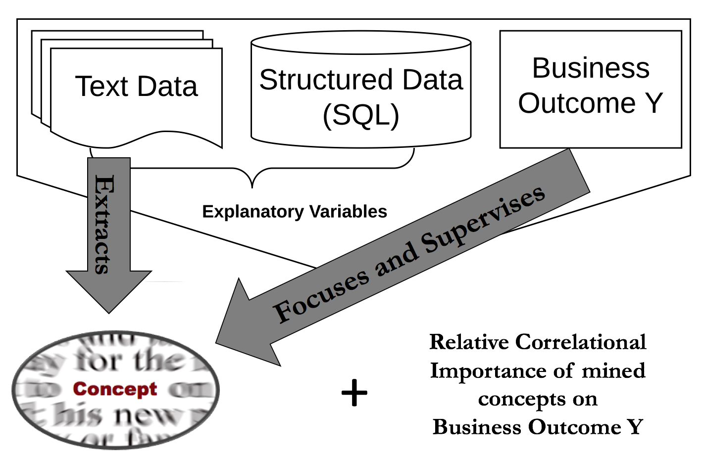

## [Download the paper](https://www.ssrn.com/abstract=3304756) 
#### [Dokyun "DK" Lee](https://www.dlforbusiness.com), [Emaad Manzoor](https://emaadmanzoor.com/), Zhaoqi Cheng
## [Download the Command Line Interface](https://github.com/ecfm/fcm_cli) developed by [Chengnfeng Mao](maochf.com)
## [Download the User Guide & Demonstration)(https://github.com/ericbzhou/fcm_cli_guide) by [Eric Zhou](https://ericbzhou.github.io/)

### Abstract
We introduce the Focused Concept Miner (FCM), an interpretable deep learning text mining algorithm to (1) automatically extract interpretable high-level concepts from text data, (2) focus the extracted concepts to correlate with user-provided business outcomes, and (3) quantify the concept correlational importance. FCM incorporates advances in neural language modeling in a supervised geometric learning framework explicitly configured to maximize interpretability. We evaluate FCM using a dataset of online purchases containing the reviews read by each consumer. Compared to 4 interpretable and 4 prediction-focused baselines, FCM attains higher interpretability as quantified by human judgments and automated metric, and higher recall of unique concepts as supported by several experiments. In addition, we find that the concepts extracted by FCM map to dimensions of product quality developed in prior literature, without being explicitly trained to do so. FCM achieves superior predictive performance compared to interpretable benchmarks while maintaining competitive predictive performance compared to uninterpretable blackbox classifiers. In further experiments, we evaluate FCM on textual data from online newsgroups and a crowdfunding platform, investigate the impact of supervision on concept recovery, and study the interpretability-accuracy trade-off. We conclude by discussing managerial implications, potential marketing applications, limitations, and ideas for future development.

**Keywords**: Interpretable Machine Learning, Deep Learning, Text Mining, Automatic Concept Extraction, Coherence, Transparent Algorithm, Augmented Hypothesis Development, XAI 

