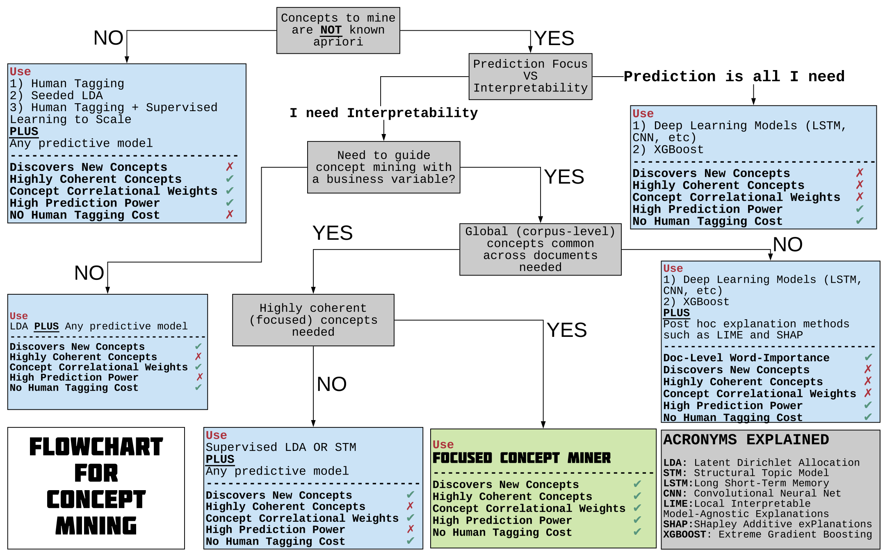

## [Download the paper](https://www.ssrn.com/abstract=3304756) 
#### [Dokyun "DK" Lee](https://www.dlforbusiness.com), [Emaad Manzoor](https://emaadmanzoor.com/), Zhaoqi Cheng

[Download the Command Line Interface](https://github.com/ecfm/fcm_cli) developed by [Chengfeng Mao](maochf.com)

[Download the User Guide & Demonstration](https://github.com/ericbzhou/fcm_cli_guide) written by [Eric Zhou](https://ericbzhou.github.io/)

### Abstract
We introduce the Focused Concept Miner (FCM), an interpretable deep learning text mining algorithm to (1) automatically extract coherent high-level concepts from text data, (2) focus concepts toward correlating with a user-specified business outcome, and (3) quantify the concept correlational importance to outcome. FCM is used to explore and potentially extract apriori unknown concepts from text that may explain business outcome. FCM is a custom neural network model explicitly configured to increase corpus-level insights and recovered-concept diversity without the need to provide any training data. 

We evaluate FCM using a dataset of online purchases containing the reviews read by each consumer. Compared to 4 interpretable baselines, FCM attains higher interpretability as quantified by 2 human-judged metrics and 1 automated metric, and higher recall of unique concepts as supported by several experiments. In addition, FCM extracted constructs relating to product quality theorized to impact conversion in literature, without being explicitly trained to do so. FCM also achieves superior predictive performance compared to 4 interpretable benchmarks while maintaining superior or competitive predictive performance compared to 8 blackbox classifiers. In further experiments, we evaluate FCM on text data from online newsgroups and a crowdfunding platform, investigate the impact of focusing on concept discovery, and study the interpretability-accuracy trade-off. We present FCM as a complimentary technique to explore and understand text data before applying standard causal inference techniques. We conclude by discussing managerial implications, potential business applications, limitations, and ideas for future development.

**Keywords**: Interpretable Machine Learning, Deep Learning, Text Mining, Automatic Concept Extraction, Coherence, Transparent Algorithm, Augmented Hypothesis Development, XAI 

